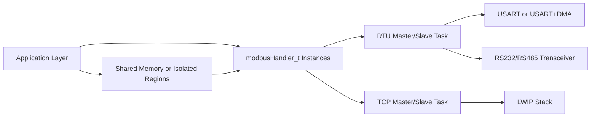

# 工业边缘 Modbus 通信中间件 | Industrial Edge Modbus Middleware for STM32 + FreeRTOS

🔥 面向工业现场的 STM32 + FreeRTOS Modbus 中间件工程（RTU/TCP/USB-CDC，主站+从站，多实例并发）。  
🚀 支持 RS232 / RS485、DMA 高波特率、可裁剪内存模型与多板卡示例。  
⭐ 适合作为工业通信网关、设备控制器、课程设计与二次开发底座。

<p align="center">
  
</p>

<p align="center">
  
  
  
  
  
</p>

---

## 目录

- [1. 项目定位](#1-项目定位)
- [2. 核心能力](#2-核心能力)
- [3. 典型应用场景](#3-典型应用场景)
- [4. 架构与线程模型](#4-架构与线程模型)
- [5. 仓库结构](#5-仓库结构)
- [6. 快速开始](#6-快速开始)
- [7. 配置说明](#7-配置说明)
- [8. 示例导入与运行](#8-示例导入与运行)
- [9. 测试脚本说明](#9-测试脚本说明)
- [10. 与基础版本的差异](#10-与基础版本的差异)
- [11. 版本规划](#11-版本规划)
- [12. 开发协议与许可](#12-开发协议与许可)

---

## 1. 项目定位

本仓库聚焦“工业通信中间件工程化”，目标不是只提供协议解析函数，而是给出可直接导入 STM32CubeIDE 的完整主站/从站项目模板，帮助你快速落地以下能力：

1. 多设备并行通信（同 MCU 内多实例）
2. RTU、TCP、USB-CDC 多链路统一抽象
3. 适配 RS232、RS485 现场总线
4. 基于 FreeRTOS 的线程安全通信任务
5. 高波特率场景下的 DMA 收发与空闲中断配合

如果你希望把本仓库作为“自己的工业通信基础仓库”，当前结构已经支持按板卡、按功能、按协议逐步扩展。

---

## 2. 核心能力

### 2.1 协议与角色

- Modbus RTU 主站 / 从站
- Modbus TCP 主站 / 从站
- USB-CDC RTU 主站 / 从站（特定板卡示例）

### 2.2 并发与实时性

- 基于 FreeRTOS 的任务并发处理
- 支持同一 MCU 上多个 `modbusHandler_t` 实例
- USART 中断模式 + DMA 模式双路径

### 2.3 存储模型

- 兼容传统共享内存模型
- 支持按 Coil / DI / Holding / Input 分离内存区与起始地址
- 支持非法地址异常响应（Exception Code 2）

### 2.4 工程化能力

- 多款开发板示例工程
- Python / Notebook 测试脚本
- 可读性较高的库目录（`MODBUS-LIB`）

---

## 3. 典型应用场景

- PLC/传感器网关（RTU 从站 + TCP 主站桥接）
- 产线设备控制器（多串口轮询）
- 边缘采集节点（RS485 采集 + 以太网转发）
- 教学与实验平台（通信协议课程、嵌入式课程）
- 设备测试工装（配合 Python 工具快速回归）

---

## 4. 架构与线程模型



线程模型建议：

- 主站任务独立运行，队列发送 telegram
- 从站任务常驻监听，按功能码读取/写入数据区
- 高速链路优先使用 DMA，降低中断负载

---

## 5. 仓库结构

```text
.
├── README.md
├── TraditionalChineseREADME.md
├── PROJECT_PROTOCOL.md
├── config
│   └── runtime.example.env
├── docs
│   ├── assets
│   │   └── logo.svg
│   └── modernization-roadmap.md
├── MODBUS-LIB
│   ├── Inc
│   ├── Src
│   └── Config
├── Examples
│   ├── ModbusBluepill
│   ├── ModbusBluepillUSB
│   ├── ModbusF103
│   ├── ModbusF429 / ModbusF429TCP / ModbusF429DMA
│   ├── ModbusH743 / ModbusH743TCP
│   ├── ModbusG070 / ModbusG431 / ModbusH503 / ...
│   └── ModbusSTM32F4-discovery
└── Script
    ├── MasterRead.ipynb
    ├── MasterWrite.ipynb
    ├── SlaveServer.ipynb
    ├── SlaveServer2.ipynb
    └── SlaveServerSerial.py
```

---

## 6. 快速开始

### 6.1 开发环境

- STM32CubeIDE（建议 1.8+，更高版本亦可）
- STM32CubeMX（集成于 IDE）
- Python 3.9+
- `pymodbus`（用于上位机测试）

### 6.2 最短启动路径（推荐）

1. 先导入 `Examples/ModbusF103` 或 `Examples/ModbusG431`
2. 编译并下载到开发板
3. 在 `main.c` 中确认从站地址、寄存器映射
4. 使用 `Script/SlaveServerSerial.py` 或 `pymodbus` 客户端验证读写

---

## 7. 配置说明

### 7.1 库配置文件

将 `MODBUS-LIB/Config/ModbusConfigTemplate.h` 复制为工程内 `ModbusConfig.h` 并按目标硬件打开宏：

- `ENABLE_USB_CDC`（USB-CDC）
- `ENABLE_TCP`（Modbus TCP）
- `ENABLE_USART_DMA`（USART DMA）

### 7.2 运行参数模板

新增 `config/runtime.example.env` 作为本地化配置模板，建议在 CI/部署中通过环境变量注入：

- 串口端口、波特率、超时
- Modbus TCP 主机/端口
- 示例脚本 Slave 地址等

### 7.3 示例脚本配置

`Script/SlaveServerSerial.py` 已支持通过环境变量覆盖默认参数：

- `MODBUS_SERIAL_PORT`
- `MODBUS_SERIAL_BAUDRATE`
- `MODBUS_SERIAL_TIMEOUT`
- `MODBUS_SLAVE_ID`
- `MODBUS_PRINT_INTERVAL`

---

## 8. 示例导入与运行

### 8.1 导入步骤

1. 在 STM32CubeIDE 选择 `Import > Existing Projects into Workspace`
2. 指向 `Examples/` 下目标工程目录
3. 勾选 `Copy projects into workspace`（可选）
4. 编译后启动调试会话

### 8.2 串口与中断注意事项

- 使用 RTU 时必须确认 USART 全局中断已开启
- DMA 模式需同时配置 RX/TX DMA 通道
- USART 中断优先级应低于（数值大于等于）RTOS 关键调度优先级

### 8.3 TCP 注意事项

- 需在 `ModbusConfig.h` 中启用 TCP 相关宏
- 某些 LWIP 初始化代码在网线插拔场景下需手工修正

---

## 9. 测试脚本说明

### 9.1 Notebook

Notebook 默认演示本地/局域网测试，已将历史硬编码 IP 替换为可移植示例地址。

### 9.2 Python 串口从站

`Script/SlaveServerSerial.py` 已重构为可配置启动：

- 默认串口：`COM6`
- 默认波特率：`115200`
- 支持环境变量覆盖
- 启动时打印运行配置，便于排错

---

## 10. 与基础版本的差异

当前仓库已完成以下工程化调整：

- 重构首页文档为中文主导、英文辅助说明
- 新增项目 Logo 与统一命名
- 移除个人赞助入口与捐赠链接
- 新增项目协议文件 `PROJECT_PROTOCOL.md`
- 新增配置模板 `config/runtime.example.env`
- 将 Python 串口脚本改为环境变量驱动
- 清理示例文件中的本机绝对路径与私有网络地址
- 增加系统化改造路线图 `docs/modernization-roadmap.md`

---

## 11. 版本规划

- `v1.x`: 稳定维护现有 RTU/TCP/USB-CDC 核心功能
- `v2.x`: 提供更完善的主站功能码包装接口与测试覆盖
- `v3.x`: 引入更标准化的配置中心与设备档案模型

详见 `docs/modernization-roadmap.md`。

---

## 12. 开发协议与许可

- 开发约定、分支规范、配置安全规范：见 `PROJECT_PROTOCOL.md`
- 开源许可：见 `LICENSE`
- 如需追踪历史兼容关系，可对照上游公开仓库的协议实现

